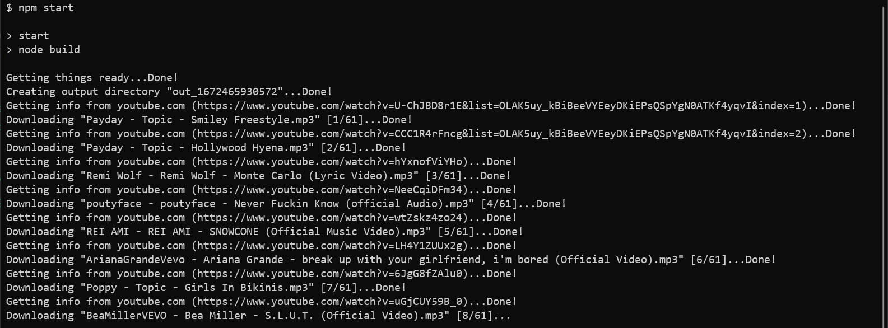
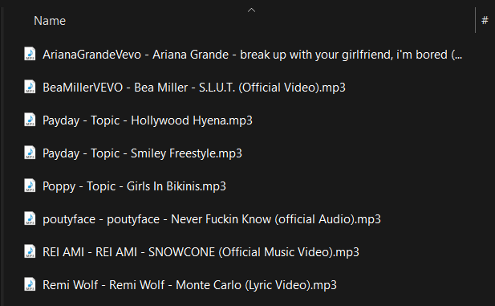

# ytdl-from-excel

This simple app takes an Excel workbook with a column full of youtube links and 
downloads them as mp3 files.

  
  

## How to build from source

1. Install [Node v18+](https://nodejs.org/) and [NPM](https://www.npmjs.com/)
2. Run `npm install -D`
3. Run `npm run build`

## How to run

1. Create your `.env` file to set environment variables
2. Run `npm start`
